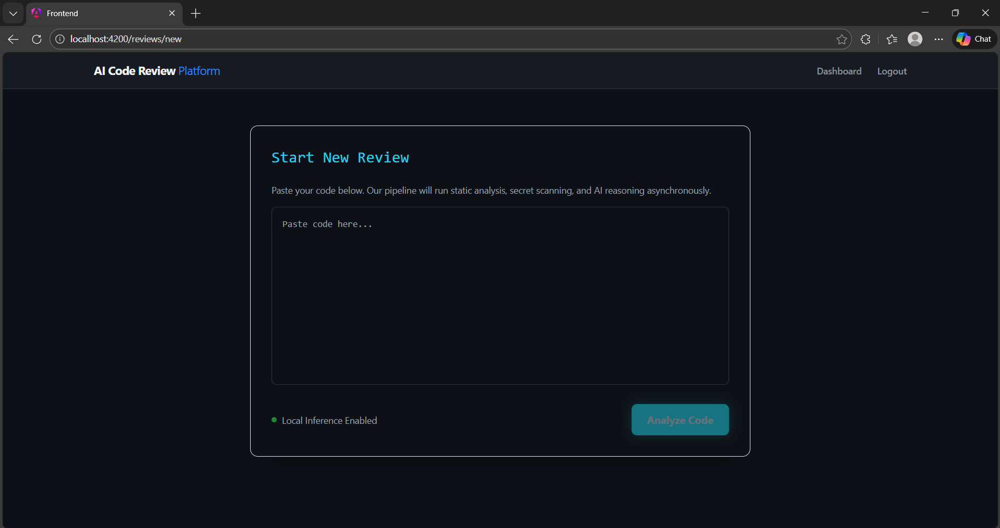
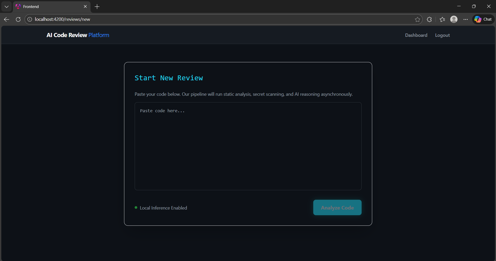

# 🤖 AI-Powered Code Review Assistant


A full-stack AI-driven code review platform that combines static analysis, security scanning, and large language model reasoning to generate structured explanations and verifiable code fixes with side-by-side diff visualization.

---

## 🔰Why This Project?

Modern development teams rely heavily on automated analysis tools, but most tools stop at reporting issues. This system goes further — combining static analysis, security scanning, and AI-driven reasoning to generate actionable, verifiable code fixes rendered directly in a developer-friendly diff viewer.

The goal is to bridge the gap between detection and remediation.

---

## 📸Screenshots

### 1. Workspace Projects Dashboard
*Glassmorphism UI displaying recent analysis jobs.*


### 2. New Review Page


### 3. Review Pipeline Progress Screen


### 4. Monaco Diff Viewer
*Red/Green diff rendering with AI-generated fixes.*


### 5. Red-Team Security Interception
*The pipeline halts and prevents data leakage when sensitive secrets are detected.*


---

## 🏛️ Architecture

```
Angular Frontend
       │
       ▼
Spring Boot Backend (REST API)
       │
       ├── Static Analysis Service (Python / FastAPI)
       ├── AI Service (Ollama LLM)
       └── PostgreSQL Database
```

### Architectural Highlights

- Microservice separation between static analysis, AI reasoning, and core backend.
- Asynchronous job execution to prevent blocking API requests.
- Structured LLM output parsing to ensure deterministic patch rendering.
- Red-Team pre-processing layer to prevent sensitive data leakage.
- Database persistence of AI transformations for auditability.

---

## 🚀 Core Features

### Static Analysis
Integrates Python-based analysis (e.g., Pylint). Persists structured findings mapped directly to the code.

### Secret Scanning (Red-Team Mode)
Detects hardcoded API keys, AWS keys, and database URLs. Blocks the review pipeline if secrets are found to prevent leakage. Stores security alerts separately for auditing.

### AI-Powered Code Reasoning
Uses a local LLM via Ollama (`llama3:instruct`). The LLM is constrained via a strict JSON contract to prevent hallucinated output formats. Responses are validated and parsed server-side before persistence, ensuring deterministic diff rendering.

### Monaco Diff Viewer
GitHub-style red/green side-by-side comparison. Includes copy patch and download patch (`.diff`) functionalities. Collapsible AI explanations for a clean reading experience.

### Review Processing Pipeline

Each submission passes through a staged processing pipeline:

| Stage | Description |
|---|---|
| `QUEUED` | Job is accepted and scheduled |
| `RUNNING` | Background execution begins |
| Secret Scanning (Red-Team Gate) | Detects sensitive credentials before any AI interaction |
| Static Analysis | Tool-generated structured findings are stored |
| AI Enrichment | LLM generates explanation, structured fix, and unified diff |
| `COMPLETED` | Aggregated results become available |
| `BLOCKED / FAILED` | Execution halts if secrets are detected or errors occur |

This staged design ensures secure, non-blocking, and auditable review processing.

---

## 🧩 Tech Stack

| Layer | Technologies |
|---|---|
| Backend | Java 17, Spring Boot, Spring WebFlux, Spring Data JPA, PostgreSQL, Lombok |
| AI & Analysis | Python, FastAPI, Ollama (llama3:instruct) |
| Frontend | Angular 17 (Standalone), Monaco Editor (ngx-monaco-editor-v2), TypeScript, Tailwind CSS |

---

## 🛠️ Project Structure

```
ai-code-review-assistant/
│
├── backend/          # Spring Boot REST API
├── ai-service/       # FastAPI static analysis & AI integration
├── frontend/         # Angular client (Monaco diff viewer)
└── screenshots/      # UI reference images
```

---

## 💡Key Design Decisions

- **Local LLM (Ollama)** used instead of a hosted API for privacy and offline capability.
- **Structured AI responses** (`originalCode` + `fixedCode`) instead of raw patch strings for precise diff rendering.
- **Pre-analysis Secret Scanning** occurs before static analysis to prevent sensitive data from reaching the AI layer.
- **Polling** used instead of WebSockets for simplicity in the MVP phase.

---

## API Endpoints

| Method | Endpoint | Description |
|---|---|---|
| POST | `/api/reviews` | Submit new code for analysis |
| GET | `/api/jobs/{jobId}` | Poll the current status of the pipeline |
| GET | `/api/reviews/{reviewId}/results` | Fetch aggregated static & AI findings |
| GET | `/api/reviews` | List all historical reviews |

---

## ▶️ Running the Project

### 1. Database Setup

Ensure PostgreSQL is running and create the database:

```sql
CREATE DATABASE code_review_db;
```

### 2. Start Backend (Spring Boot)

```bash
cd backend
mvn spring-boot:run
```

### 3. Start Analysis & AI Service (Python)

```bash
cd ai-service
pip install -r requirements.txt
uvicorn main:app --reload --port 8000
```

### 4. Start Local LLM (Ollama)

```bash
ollama run llama3:instruct
```

### 5. Start Frontend (Angular)

```bash
cd frontend
npm install
ng serve
```

---

## Future Scope

**Security & Identity**
- [ ] JWT-based authentication
- [ ] GitHub OAuth integration

**Deployment & DevOps**
- [ ] Dockerized microservice deployment (docker-compose)
- [ ] CI/CD pipeline integration

**Performance & UX**
- [ ] WebSocket-based real-time updates
- [ ] Multi-language analyzer plugins
- [ ] Project-based grouping & user ownership

---

## Author

**Eshal Shanoj** — Software Engineering Student

---

## License

MIT License