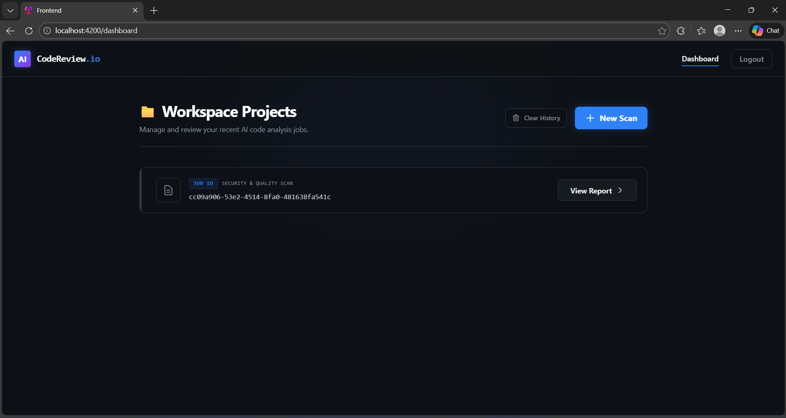
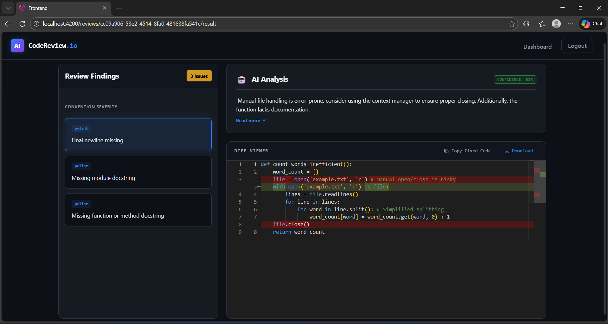
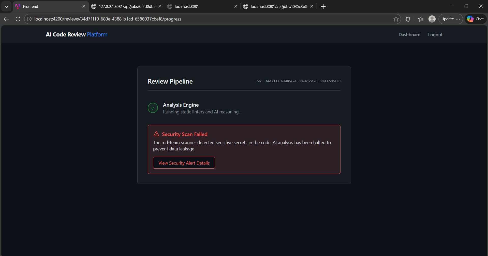

# 🤖 AI-Powered Code Review Assistant

An intelligent, multi-service platform for automated code reviews — powered by static analysis tools and AI-generated insights.

---

## 🧩 Tech Stack
- **Frontend:** Angular + Monaco Editor  
- **Backend:** Spring Boot (Java)  
- **Database:** PostgreSQL + JSONB (+ pgvector-ready)  
- **AI Service:** FastAPI + LangChain  
- **Static Analysis Workers:** Pylint / ESLint / PMD  
- **Auth:** GitHub OAuth  
- **Deployment:** Docker + Render / AWS / GCP  

---

## 📂 Monorepo Structure
frontend/ → Angular + Monaco Editor   
backend/ → Spring Boot backend   
ai-service/ → FastAPI AI microservice  
static-analysis-worker/ → Python linter worker  
database/ → SQL schema, migrations, seeds  
infra/ → Docker + CI/CD setup  
docs/ → Project documentation  

# AI-Powered Code Review Assistant (Backend)

This repository contains the backend core for an AI-powered code review system.

## Features (Current)
- Asynchronous review jobs
- Static analysis via Python workers
- Red-Team secret scanning (blocks unsafe code)
- Persistent findings and job lifecycle tracking

## Tech Stack
- Java 20
- Spring Boot 3
- PostgreSQL
- FastAPI (Python workers)# AI-Powered Code Review Assistant 🚀


A full-stack AI-driven code review platform that combines static analysis, security scanning, and large language model reasoning to generate structured explanations and verifiable code fixes with side-by-side diff visualization.

---

## 📖 Table of Contents

- [Overview](#-overview)
- [Screenshots](#-screenshots)
- [Architecture](#-architecture)
- [Core Features](#-core-features)
- [Tech Stack](#-tech-stack)
- [API Endpoints](#-api-endpoints)
- [Database Entities](#-database-entities)
- [Running the Project](#-running-the-project)
- [Future Improvements](#-future-improvements)
- [Project Goals](#-project-goals)
- [Author](#-author)
- [License](#-license)

---

## 🔥 Overview

This project is a microservice-based AI code review system designed to:

- Perform static code analysis
- Detect hardcoded secrets (Red-Team mode)
- Generate AI-powered explanations and patches
- Render Git-style diffs using Monaco Editor
- Process jobs asynchronously
- Persist results in PostgreSQL

The system is designed with production-oriented architecture principles and modular extensibility.

---

## 📸 Screenshots

### 1. Workspace Projects Dashboard
*Glassmorphism UI displaying recent analysis jobs.*



### 2. Side-by-Side Monaco Diff Viewer
*Red/Green GitHub-style diff rendering with AI-generated fixes.*



### 3. Red-Team Security Interception
*The pipeline halts and prevents data leakage when sensitive secrets are detected.*




---

## 🏗 Architecture

```
Angular Frontend
       │
       ▼
Spring Boot Backend (REST API)
       │
       ├── Static Analysis Service (Python / FastAPI)
       ├── AI Service (Ollama LLM)
       └── PostgreSQL Database
```

---

## ✨ Core Features

### ✅ Static Analysis
Integrates Python-based analysis (e.g., Pylint-style findings) and persists structured findings mapped directly to the code.

### 🔐 Secret Scanning (Red-Team Mode)
Detects hardcoded API keys, AWS keys, and database URLs. Blocks the review pipeline if secrets are found to prevent leakage, and stores security alerts separately for auditing.

### 🤖 AI-Powered Code Reasoning
Uses a local LLM via Ollama (`llama3:instruct`) to generate a detailed explanation, confidence score, original code snippet, fixed code snippet, and unified diff patch.

### 🧠 Structured Patch Generation
AI returns strictly structured JSON containing `originalCode`, `fixedCode`, `patch`, and `confidence`, enabling precise side-by-side diff visualization on the client.

### 🖥 Monaco Diff Viewer
GitHub-style red/green side-by-side comparison with copy patch and download patch (`.diff`) functionalities, plus collapsible AI explanations for a clean reading experience.

### ⚡ Asynchronous Job Execution
Background job processing using Java Executors with status tracking (`QUEUED`, `RUNNING`, `BLOCKED`, `COMPLETED`, `FAILED`) and RxJS polling-based progress tracking on the frontend.

---

## 🛠 Tech Stack

| Layer | Technologies |
|---|---|
| **Backend** | Java 17 · Spring Boot · Spring WebFlux (WebClient) · Spring Data JPA · PostgreSQL · Lombok |
| **AI & Analysis** | Python · FastAPI · Ollama (`llama3:instruct`) |
| **Frontend** | Angular 17 (Standalone) · Monaco Editor (`ngx-monaco-editor-v2`) · TypeScript · Tailwind CSS |

---

## 📦 API Endpoints

| Method | Endpoint | Description |
|---|---|---|
| `POST` | `/api/reviews` | Submit new code for analysis |
| `GET` | `/api/jobs/{jobId}` | Poll the current status of the pipeline |
| `GET` | `/api/reviews/{reviewId}/results` | Fetch aggregated static & AI findings |
| `GET` | `/api/reviews` | List all historical reviews |

---

## 🗄 Database Entities

- **Job** — Tracks async execution state and timestamps.
- **Finding** — Stores static analysis rules, line numbers, and the AI payload (explanation, confidence, original code, fixed code, patch).
- **SecurityFinding** — Stores blocked secrets intercepted by the Red-Team scanner.

---

## 🚀 Running the Project

### 1️⃣ Database Setup

Ensure PostgreSQL is running and create the database:

```sql
CREATE DATABASE code_review_db;
```

### 2️⃣ Start Backend (Spring Boot)

```bash
cd backend
mvn spring-boot:run
```

Runs on: `http://localhost:8081`

### 3️⃣ Start Analysis & AI Service (Python)

```bash
cd ai-service
pip install -r requirements.txt
uvicorn main:app --reload --port 8000
```

Runs on: `http://localhost:8000`

### 4️⃣ Start Local LLM (Ollama)

```bash
ollama run llama3:instruct
```

### 5️⃣ Start Frontend (Angular)

```bash
cd frontend
npm install
ng serve
```

Runs on: `http://localhost:4200`

---

## 📌 Future Improvements

- [ ] JWT Authentication & user ownership
- [ ] Dockerized microservice deployment (`docker-compose`)
- [ ] GitHub OAuth integration
- [ ] WebSocket real-time updates (replacing HTTP polling)
- [ ] Multi-language support (JavaScript, Java, Go)
- [ ] CI/CD Pipeline integration

---

## 🎯 Project Goals

This system demonstrates:

- Microservice communication
- AI-driven code remediation
- Secure code processing pipelines
- Structured LLM output parsing
- Full-stack integration
- Production-oriented architecture

---

## 👩‍💻 Author

**Eshal Shanoj** — Software Engineering Student

---

## 📄 License

This project is licensed under the [MIT License](LICENSE).
- Pylint

## Status
Phase 1 complete.
Phase 2 (AI reasoning + patch generation) in progress.

## Security
- Code is never executed
- Secrets are detected and blocked before analysis
- No secrets are stored in plaintext
